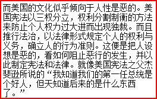
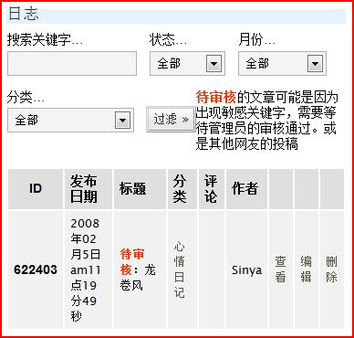

这就是ＴＭＤ yo2。

就是一篇文章有以下一段。

结果就

见[旧文](http://sinya.yo2.cn/cannot-get-a-good-blog.html)，那是yo2博客停止对外开放时写的。感情很激烈。

呵呵，现在连ＴＭＤ都要用微软日语输入法的Full-width Alphanumeric。yo2的人不会聪明到连这个都过滤吧！

是不是去[72pines](http://sinya.72pines.com "我在72pines的博客")呢？那边快一点。而且服务器在美国。