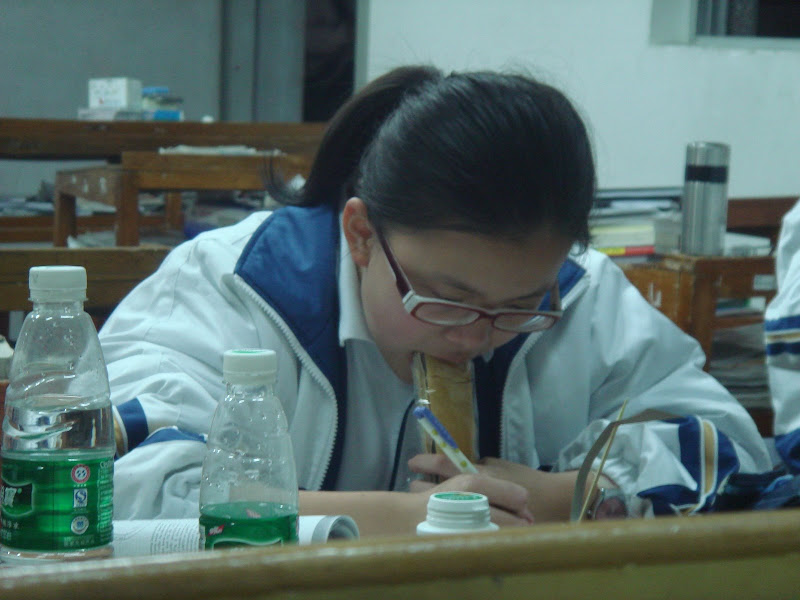
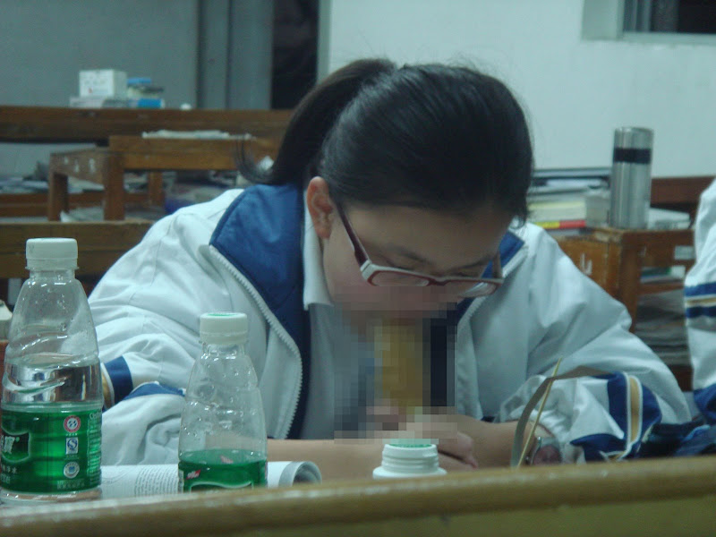
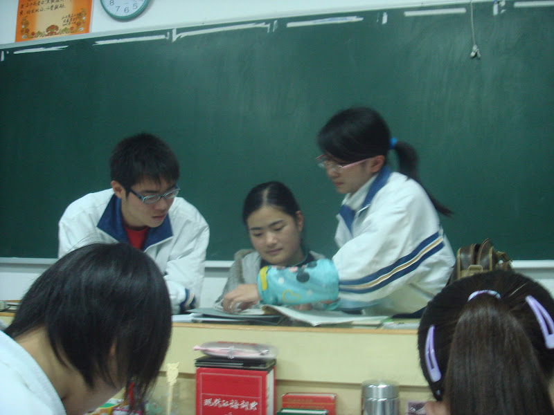
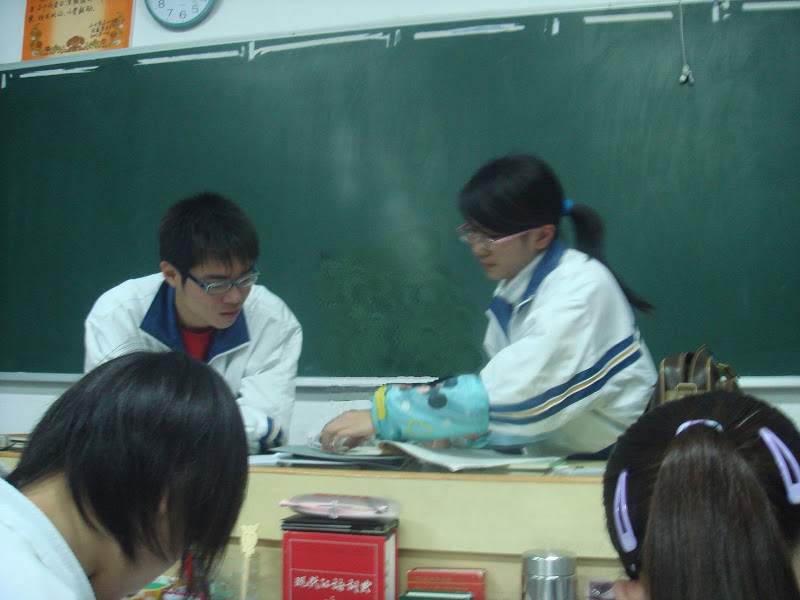

之前下载了Adobe的CS3便试试使用神奇的Photoshop。之前我没有Photoshop的基础。只能摸索着用。先试着Ps了2幅照片。（之前[这个](http://sinya.yo2.cn/exam-result2.html "期末考成绩出来了")不算）

上面这组图是马赛克处理，裁剪，再作为一个新图层放到原图上去。

这组图不用说了，用画笔把历史老师涂掉。

画黑板用了散点的画笔，加上颜色和亮度抖动。画墙也基本差不多。再用减淡工具 在黑板上补上光照效果。

毕竟算是第一次Ps照片。以后再接再厉！

P.S.为什么我Ps出来的照片都没有正经的。-\_-|||

Update:葱头在下面告诉我用仿制图章更好。我摸索着用了一下，确实效果比我用画笔好很多，至少是直接从黑板复制。于是就重新PS了一幅，如下

