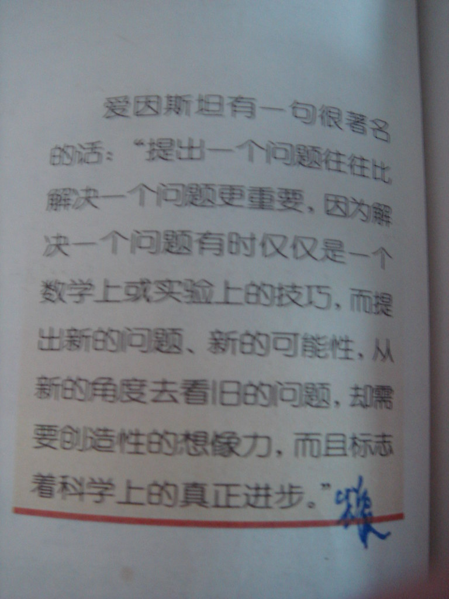
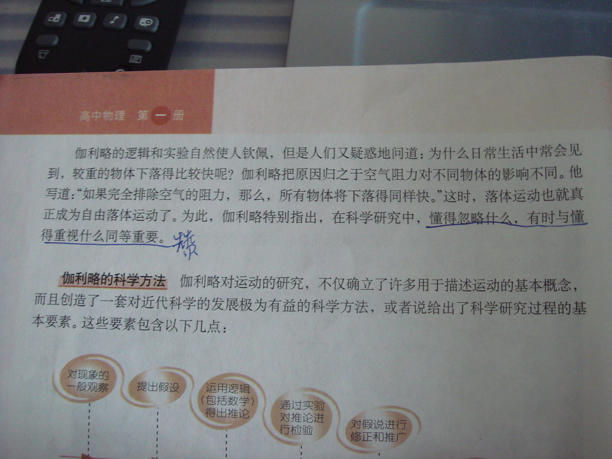
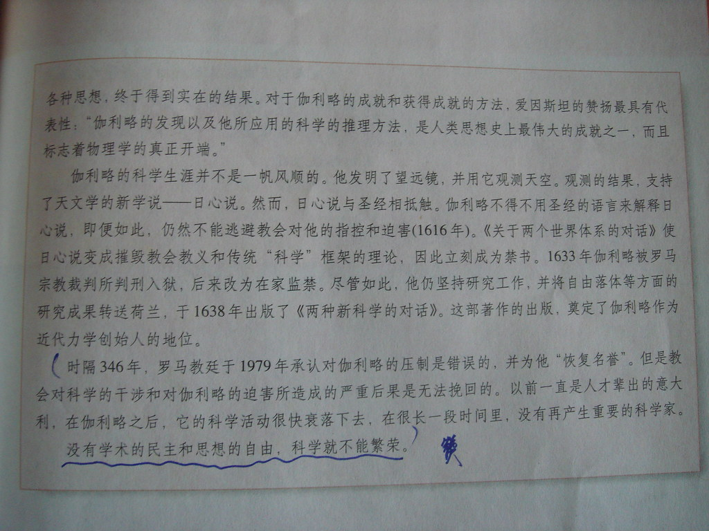

这一节超赞的课叫做伽利略对自由落体运动的研究，必修一第二单元的第五课。当刚拿到必修一时，看到这节课，就知道老师对这节课不会很重视，毕竟这节课里面没有什么知识点，对你的考试没有任何促进作用。果然老师没有教这节课，让同学们自己回家去看。

但是这节课绝对不是那么简单。我认为这节课是正本物理课本的亮点，是这本物理课本的精华所在。其他课也许指教了某个知识点。而这节课教的是物理学研究的方法，理念，还有思想。这是真正的素质教育的课文。这教授我们的是能力，而不仅仅是知识点！

课文后面的STS(science, technology & society 即科学、技术与社会)也很赞。题目是《从伽利略的一生看科学与社会》。内容有关伽利略对科学，还有人类思想解放的贡献。也讲到了罗马教廷对伽利略研究的压制及其影响。很精彩。

这篇课文实在是很赞。**妙语连珠**。我在课文中三处划了下划线，标注上“赞”字。见下图。

（具体内容就不用文字格式放上来了，避免[上次龙卷风那篇文章的命运](http://sinya.yo2.cn/t-m-d-yo2.html "旧文：这就是ＴＭＤyo2")。这一篇就不会被那样子了吧。我只是把一篇课文拿上来而已啊……还是人教版的呢……）  
  

课文原文在下面点击看大图

 

Update: 2008.8.9我从新修改了图片地址——原来的[被yupoo删了](http://sinya.yo2.cn/tmd-yupoo " 他妈的又拍网Yupoo，删我的照片还插广告！！！ ")。