个周是我们学校的创造节，也是我比较倒霉的哪一个周。

首先是周二班级准备合唱比赛歌曲的时候，我在吹气球，无作无泥地被莫叫去批。

那一天广播站播音，忙得没吃晚饭没晾衣服，晚上好不容易搞到一碗面，结果室友的袜子划过一道优美的**抛物线**（应该是**抛物线**而不是**弧线**）掉到我的面里面去。我很生气地踢了一下门，结果被宿管抓去见庄仕雄主任……（顺便贴一个谜语。木兰从军，打金中一老师………………………………………………………………………………答案：庄仕雄（装是雄）…………………………………………冷到爆　:oops: ）

钱包饭卡还不见了……

周五寒冰的版画专场跟王珏分在了一起…… 😳

但是就像上学期那个倒霉的周一样，最后总会变好的……钱包找到了，只不过我在广播站通讯录上的涂鸦被看到了……

### 贴图吧（全部点击看大图）：

#### D302宿舍

#### [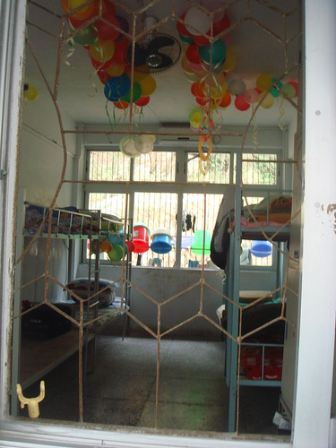](http://www.flickr.com/photos/11713956@N08/2406823815/)

[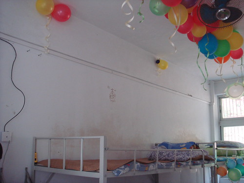](http://www.flickr.com/photos/11713956@N08/2407654610/)

[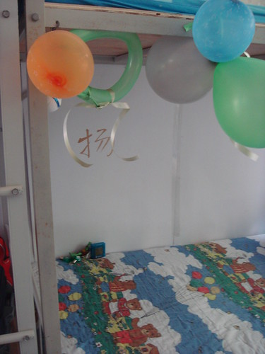](http://www.flickr.com/photos/11713956@N08/2407652344/)[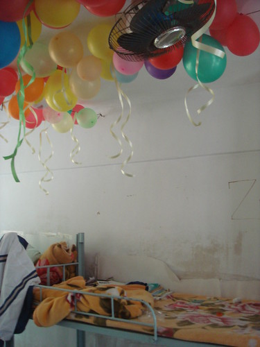](http://www.flickr.com/photos/11713956@N08/2407649824/)

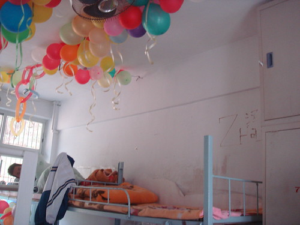

+++++++++++++++++++++++++++++++++++++++++++++++++++++++

#### 202班潮汕小吃专场

[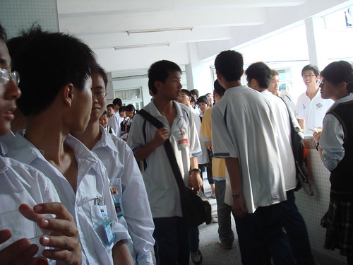](http://farm4.static.flickr.com/3268/2406832007_074df16ae7_b.jpg)  
队伍的后面

[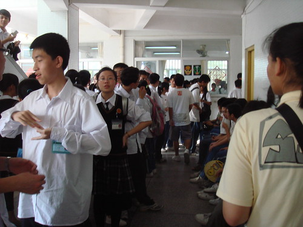](http://farm3.static.flickr.com/2297/2406830635_054ec2d16b_b.jpg)  
队伍的前面

[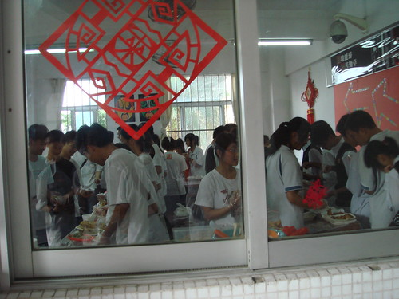](http://farm3.static.flickr.com/2046/2406833423_20d8276bef_b.jpg)  
里面

人还真是多啊——金中的人还真饿啊……

\======================================================

#### “爱拼才会赢”——水果拼盘大赛

[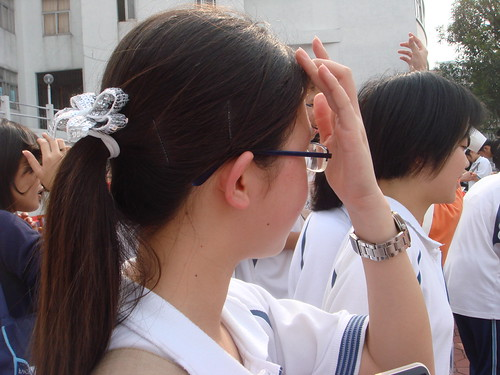](http://farm3.static.flickr.com/2360/2406825259_5f60217720_b.jpg)  
她先拍我吃水果的…… = =|||

[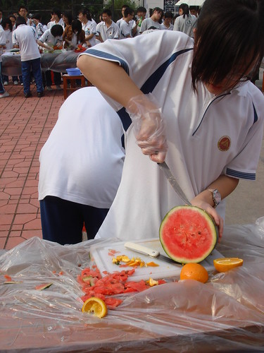](http://farm4.static.flickr.com/3059/2406826719_e030b82f5b_b.jpg)  
不是在报复我在旧文[神奇的Photoshop(多图)](http://sinya.yo2.cn/photoshop.html "神奇的Photoshop(多图)")那幅被我打了马赛克的吃面包的图吧…… = =|||

[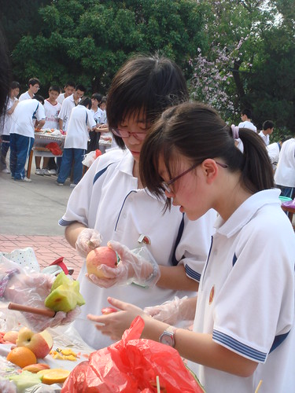](http://farm3.static.flickr.com/2226/2407660288_9b4aa4338e_b.jpg)  
认真……

[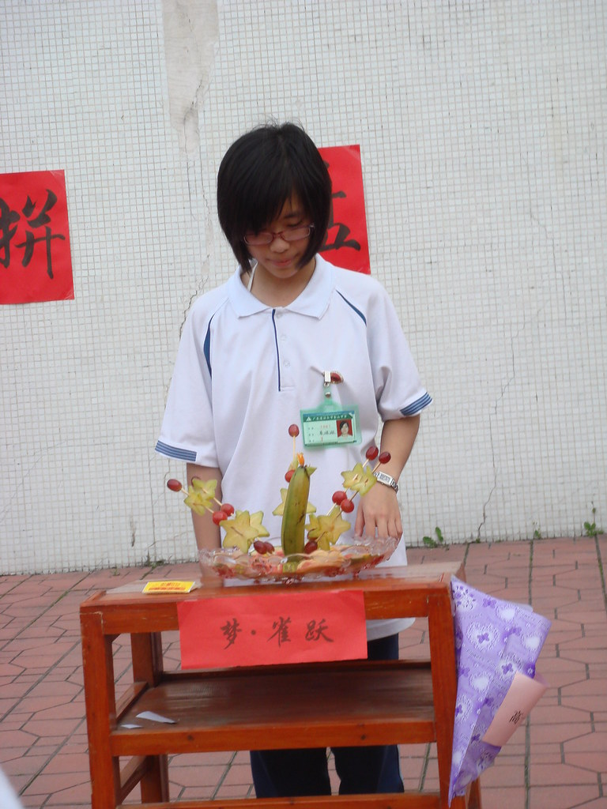](http://farm3.static.flickr.com/2363/2406829431_649aa7fa95_b.jpg)  
完成啦!!!