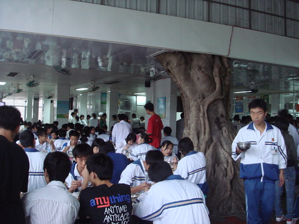
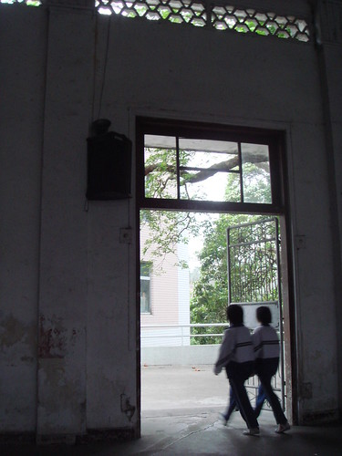
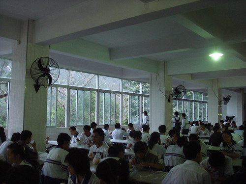
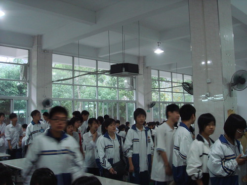
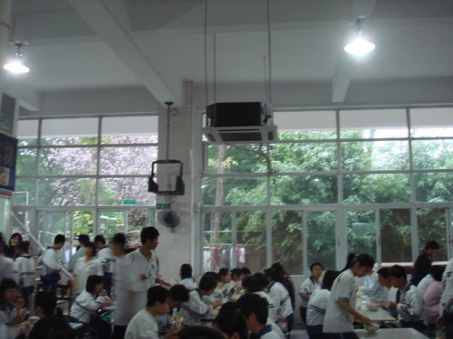
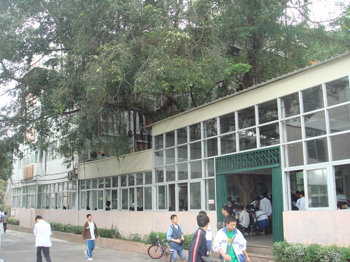
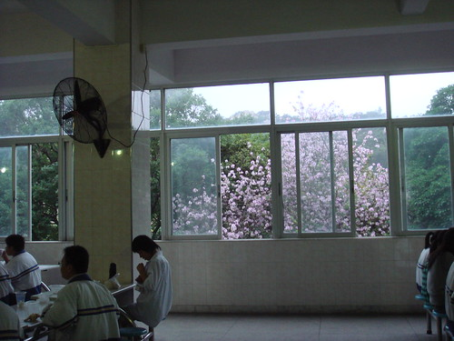
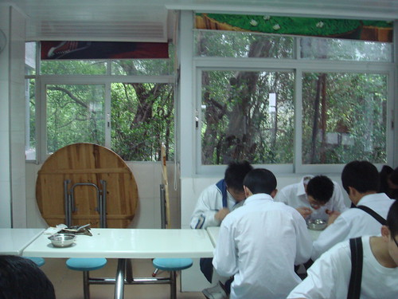

 摄影展之二在[这里](http://sinya.yo2.cn/photos2)

  
汕头市金山中学的第二食堂，一棵树从食堂内穿过天花板长到外面。

  
汕头市金山中学大礼堂，文革时期留下的标语（在门左边的柱子上，现已被刷上漆，只留下一点点痕迹）依稀可见。Update: 被刷上的应该是石灰而不是漆（画外音：有必要专门来更正这个没有啊……）

  
汕头市金山中学大食堂(第一食堂)早餐场景。窗外绿树成荫

  
汕头市金山中学的地下食堂(第三食堂)，也就是第三食堂。窗外繁花似锦，绿树成荫

  
汕头市金山中学的地下食堂，也就是第三食堂。窗外繁花似锦，绿树成荫

  
汕头市金山中学的第二食堂，一棵树从食堂内穿过天花板长到外面。

  
汕头市金山中学大食堂(第一食堂)早餐场景。窗外绿树成荫。注意到那花吗，就是地下食堂那一棵树

  
第四食堂，窗外是茂密的树木

#### 后记：

为什么要把这篇文叫做“这就是金中呢？”我们来看看华师附中的照片就知道了:

我们知道，哪个是家，那个是笼子……