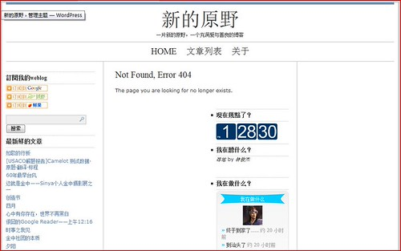

刚才修改了[Blue Zinfandel 3-Column](http://www.briangardner.com/themes/blue-zinfandel-wordpress-theme.htm)模板。

**先是改了footer.php**，把原来写在footer插件里面雅虎统计的代码移到footer部分。然后把yo2篡改的的信息删掉。

**然后是修改了404页。**404页有一个bug，就是右侧边栏侧边栏显示不正常。如图：

原来的404.php文件如下。

> <?php get\_header(); ?>
> 
> 

> 
> <?php include(TEMPLATEPATH.”/l\_sidebar.php”);?>
> 
> 

> 
> 
  
> <h1>Not Found, Error 404</h1>   
> 
The page you are looking for no longer exists.
  
> 
  
> <?php include(TEMPLATEPATH.”/r\_sidebar.php”);?>  
> 

> 
> <!– The main column ends –>
> 
> <?php get\_footer(); ?>

很明显，“
 ”这句没有对应的“
”所以右边栏被显示在中間栏。故只要在“<?php include(TEMPLATEPATH.”/r\_sidebar.php”);?>”前加入“
”就好了。如下修改：

> <?php get\_header(); ?>
> 
> 

> 
> <?php include(TEMPLATEPATH.”/l\_sidebar.php”);?>
> 
> 

> 
> 
  
> <h1>Not Found, Error 404</h1>   
> 
The page you are looking for no longer exists.
  
> 
  
> 
  
> <?php include(TEMPLATEPATH.”/r\_sidebar.php”);?>  
> 

> 
> <!– The main column ends –>
> 
> <?php get\_footer(); ?>

但是，404页对我有特别的意义，所以我做了汉化，再贴了幅创意图。修改如下

> <?php get\_header(); ?>
> 
> 

> 
> <?php include(TEMPLATEPATH.”/l\_sidebar.php”);?>
> 
> 

> 
> 
  
> <h1>错误404: 没有找到这一页</h1>  
> <h4>人生的这一页已随风而去了……</h4>  
> <h4>It has gone with the wind…</h4>  
> 
 
  
> 

> 
> 
  
> <?php include(TEMPLATEPATH.”/r\_sidebar.php”);?>  
> 

> 
> <!– The main column ends –>
> 
> <?php get\_footer(); ?>

要注意的是，这些模板原来都是ANSI编码的，如果输入中文会造成乱码。解决方法很简单：只要用记事本打开，点击另存为，在下面的编码选择中选择utf-8就好了。

试着看一下404页：[http://sinya.yo2.cn/i-got-married](http://sinya.yo2.cn/i-got-married), 或者[这里](http://sinya.yo2.cn/first-love)