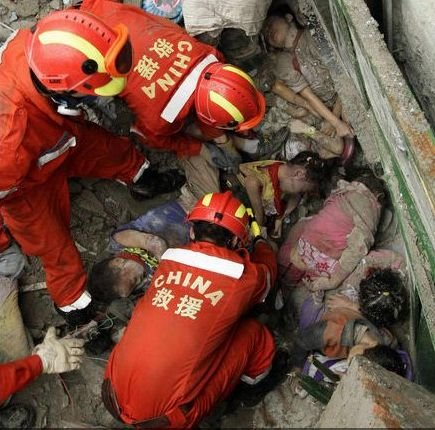
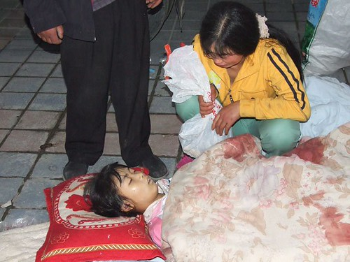
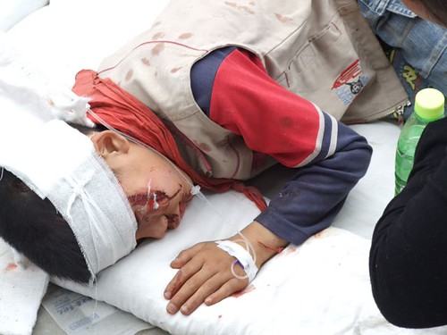
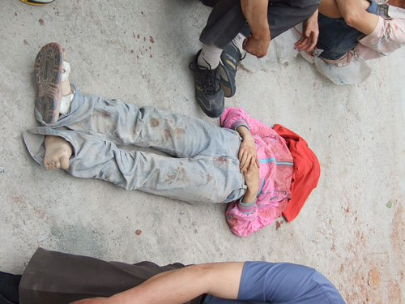
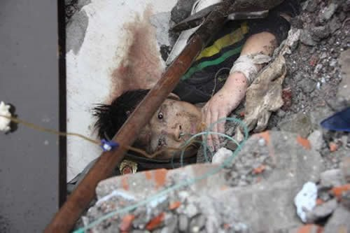
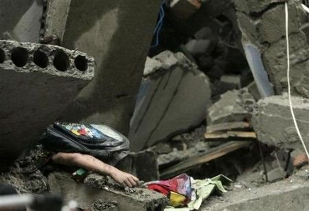
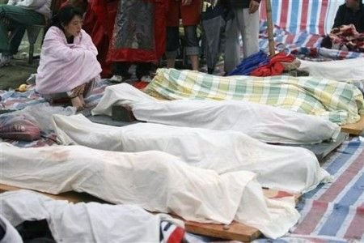
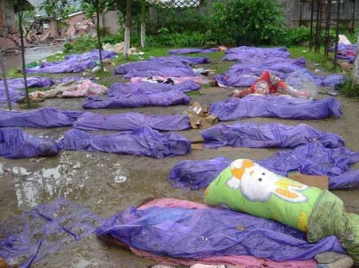

08四川大地震。

唯一的想法，是逃避……不想再面对现实……

刚才看着凤凰台上面，时间正一秒一秒流逝，快128小时了……不知有多少人，还埋在废墟下。我这一觉睡去，醒来时，多少生命已经流逝……

转一篇让人震撼的文章，来自[Vane Talk](http://www.vaneshi.com/blog) (之前转过她一篇[祭兔子](http://sinya.yo2.cn/the-rabbits-death)，亦是有关生命，还有生命脆弱的。也是之前我唯一转过的文章……)

#### [殇](http://www.vaneshi.com/blog/2008/05/sichuan-wenchuan-earthquake-3/ "原文")

松枝送子，人间炼狱。希望天堂没有地震~  
  
  
  
  
  
  
  
