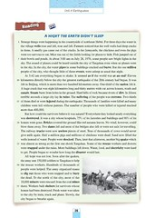

地震等天灾前是否会有征兆？老人们都很坚信这一点。

甚至我们的英语课本也这么认为……见下（点击看大图）：

 

辞海跟我说四川电视台在5月10日一则新闻，讲好多蟾蜍跃到路上，可是林业专家说，这是环境好的标志，甚至有村民说，蟾蜍上街来迎奥运……-\_-|||真是让人愤怒又无语。

国内视频网站都封杀这段视频，只有YouTube存留……见下  
Update：

还有这幅强图：阿坝省防震减灾局成功平息地震误传事件

