摄影展之一在[这里](http://sinya.yo2.cn/photos1)

**光和影的追寻者，Sinya，为您带来黑暗的夜，还有黑暗中的点点光明。** 最满意的是这一张高低远近错落有致，花坛，山坡，灯光，金中图书馆和远处的礐石大桥相映成趣。

然后是这一张，《夜归》 我趴在教室的窗上（严重鄙视谷歌拼音输入法，竟然给我显示“趴在教师的床上”），透过窗拍的（我没有带三角架，只能这样子固定了）。 下面是所有的照片，大部分是上学期拍的。点击到flickr页面，有介绍&大图。

### Eyes of Night

**All the photos**  
[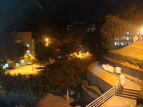](http://www.flickr.com/photos/sinya/2557593744)[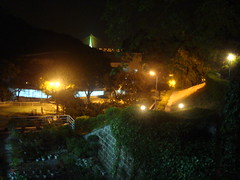](http://www.flickr.com/photos/sinya/2556769203)[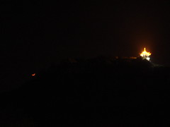](http://www.flickr.com/photos/sinya/2556758969)[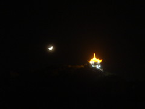](http://www.flickr.com/photos/sinya/2557589638)[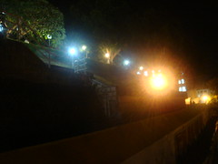](http://www.flickr.com/photos/sinya/2557591126)[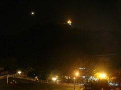](http://www.flickr.com/photos/sinya/2557588672)[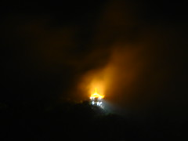](http://www.flickr.com/photos/sinya/2557579966)[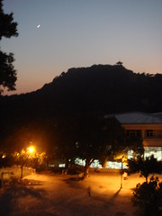](http://www.flickr.com/photos/sinya/2556759555)[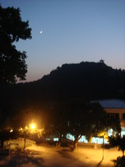](http://www.flickr.com/photos/sinya/2557584154)[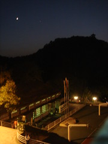](http://www.flickr.com/photos/sinya/2557585782)[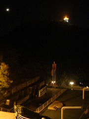](http://www.flickr.com/photos/sinya/2557587336)