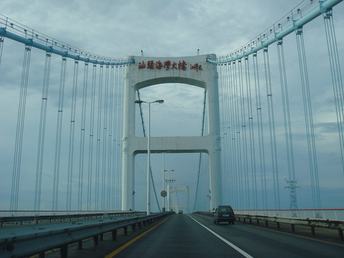
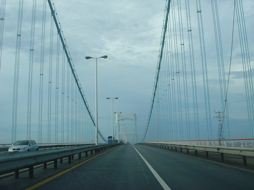
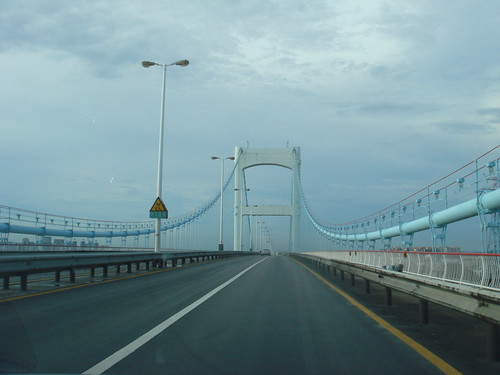
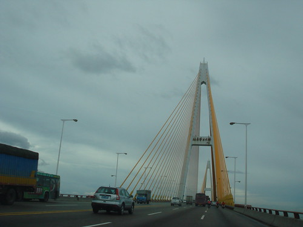
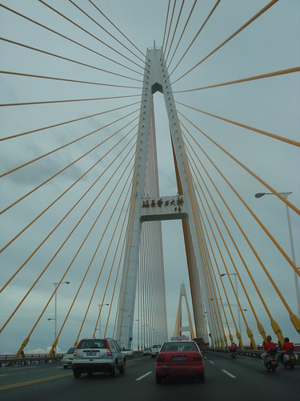
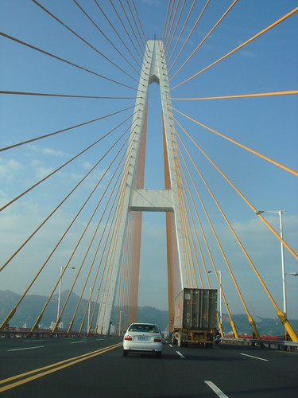
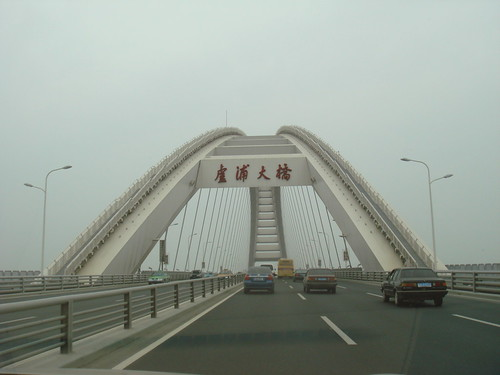
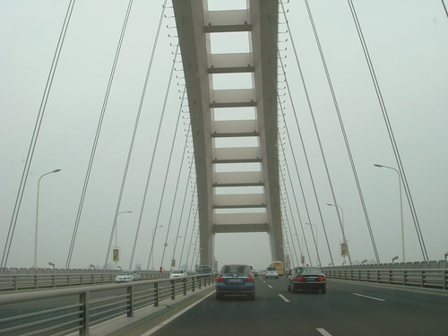

很久很久以前，我转过简单的一篇文章，《[条条大桥通彼岸](http://jandan.net/2007/10/01/32-amazing-bridges-from-around-the-world-pics.html)》，但发现，我的blog不应该成为转载文章的空间，所以后来就把它删掉了。这也是[旧文：Blog第100篇](http://sinya.yo2.cn/100th)之所以讲这一篇不知道算99篇还是第100篇的原因。（之一）

但是，我还是震撼于桥梁那种壮丽的美感。期末考前一个星期很光荣的走读啦。礐石大桥海湾大桥都走过，贴几张图。

远观大桥有自身独特的美感，但跟在路上拍是不一样的，不能达到“横看成岭侧成峰”的独特的透视效果。

### 海灣大橋(悬索桥)

### 礐石大桥（斜拉桥）

### 顺便贴两张卢浦大桥（拱桥）

