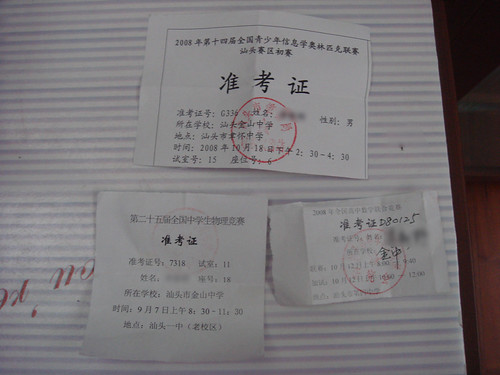

刚刚考完了NOIP2008的初赛。因为\_GXX叫我神牛想要升RP，但跟据《RP导论与信息学竞赛》，这客观上让我升了RP，这次初赛还不会太糟糕。

先贴上试题和答案（如果似乎只能用Firefox和safari打开，如果还是打不开吧http改成https）

试卷：[http://docs.google.com/Doc?id=dhq9z66j\_176czs9kxdw](http://docs.google.com/Doc?id=dhq9z66j_176czs9kxdw)

答案：[http://docs.google.com/Doc?id=dhq9z66j\_177hh87wdqk](http://docs.google.com/Doc?id=dhq9z66j_177hh87wdqk)

但是复赛才是最重要的，今年还有[APIO](http://baike.baidu.com/view/925074.html "百度百科：APIO")不是吗，可以去澳洲暹罗天津玩e.

贴一下准考证：

再贴一下五月天的新歌《出头天》

//  

//  

//

还没考试时遇到了学新，可是考完出来在买小吃的时候，我叫了跟她爸爸一起回家的恩儿，可是她没反应……也许没听到，也许她忘了我，也许装作没看到我吧……

三中旁边的小吃店还真是多啊……