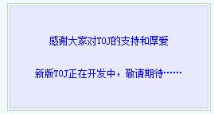

好吧我来做一些无聊的事情，把一些很久以前的旧程序翻出来。

### 一

首先放一个似乎是最早的一个完整的程序。

program Lee;
  var
    a,b,c,f:real;
    e,g:longint;
    i:integer;
    d:char;

  procedure plus;
    begin
      readln(b);
      a:=a+b;
    end;

  procedure reduce;
    begin
      readln(b);
      a:=a-b;
    end;

  procedure multiplication;
    begin
      readln(b);
      a:=a\*b;
    end;

  procedure division;
    begin
      readln(b);
      a:=a/b;
    end;

  procedure power;
    begin
      readln(e);
      c:=a;
      if e>1 then begin for i:=2 to e do a:=a\*c end;
      if e=0 then a:=1;
      if e=1 then a:=a;
      if e=-1 then a:=1/a;
      if e<-1 then begin for i:=2 to e do begin a:=a\*c end; a:=1/a end;
    end;

  procedure kaipingfang;
    begin
      read(b);
      a:=exp(1/b\*ln(a));
    end;

  procedure jue;
    begin
      a:=abs(a);
    end;

  procedure xiangfan;
    begin
      a:=-a;
    end;

  procedure du;
    begin
      a:=a\*3.141592653/180
    end;

  procedure cos1;
    begin
      f:=a;
      du;
      a:=cos(a);
      if f=180 then begin e:=round(a);a:=e;end;
      if f=90 then begin e:=round(a);a:=e;end;
      if f=0 then begin e:=round(a);a:=e;end;
    end;

  procedure sin1;
    begin
      f:=a;
      du;
      a:=sin(a);
      if f=180 then begin e:=round(a);a:=1;end;
      if f=90 then begin e:=round(a);a:=1;end;
      if f=0 then begin e:=round(a);a:=1;end;
    end;

  procedure div1;
    begin
      readln(g);
      e:=round(a);
      a:=e div g;
    end;

  procedure mod1;
    begin
      readln(g);
      e:=round(a);
      a:=e mod g;
    end;

  procedure chuli;
    begin
      if d='c' then begin a:=0;readln(a);readln(d);end;
      if d='+' then plus;
      if d='-' then reduce;
      if d='\*' then multiplication;
      if d='/' then division;
      if d='p' then power;
      if d='j' then jue;
      if d='f' then xiangfan;
      if d='o' then cos1;
      if d='s' then sin1;
      if d='k' then kaipingfang;
      if d='d' then div1;
      if d='m' then mod1;
      if d='c' then exit;
      if d='=' then begin writeln(a);readln(d);exit;end;
      if d='x' then exit;
      readln(d);
      if d='c' then exit;
      if d='=' then exit;
      writeln(a);
    end;

  begin
    readln(a);
    readln(d);
    while d<>'x' do chuli;
  end.

这算是我最早的一个程序了……写于2004/9/4 15:54。

当时我在暑假学了6天大概的Pascal，然后跟一大堆老师去东南亚玩了一圈回到汕头。当姚老师还没有接手我，我还在金园实验练习乒乓球的时代很无聊的写了这个很不好用的计算器程序。

不过我发现当时我竟然会用到模块化编程。甚至自己去找资料了解三角函数。

### 二

好像初一一年就拿着姚老那些自认为可以出版（可是没有出版社愿意出版）的资料重新系统学习Pascal，也在飞厦OI学习……这段时间很少程序存档。

等到初二的时候似乎就开始在飞厦OI活跃起来了，记得当时还在那边教初一。似乎那时候就知道了vijos，还有USACO。当时做了vijos一道表述不清楚的题目（这经常发生），然后对vijos完全失望。韦老师跟我说USACO，说gXX已经USACO刷到1.3了，我觉得好神奇，不过看到全英的界面就打了退堂鼓。所以初二那段时间主要刷同济大学的题库。

首先贴一下TOJ1002全排序

var
  a:array\[1..20\]of byte;
  i:byte;
  j:byte;
  n:byte;
  c:set of byte;
  d:string;

procedure abc;
  begin
    begin
      c:=\[\];
      for j:=1 to n do
        begin
          if a\[j\]in c then exit
                      else c:=c+\[a\[j\]\];
        end;
      for j:=1 to n-1 do write(d\[a\[j\]\],' ');
      write(d\[a\[n\]\]);
      writeln;
    end;
  end;

begin
  readln(d);
  n:=length(d);
  for i:=1 to n do a\[i\]:=0;
  i:=1;

  while i>0 do
    begin
      a\[i\]:=a\[i\]+1;
      if i=n then abc;
      if i<n then i:=i+1;
      while a\[i\]=n do
        begin
          i:=i-1;
          a\[i+1\]:=0;
          if i=0 then exit
        end;
    end;
end.

这程序写于2005/10/29 14:39，那一天是周六，应该是在飞厦OI或者之前写的。当时我懒得看程序，也就不知道递归实现全排列，所以我就自己发明了这种“模拟递归”，或者类似n进制高精度加法的方法来写搜索的题目。 -\_-|||

还记得当时我用我自己发明的这种OX方法跟师弟讲，然后郭亨凯讲的是标准方法……结果我对郭亨凯递归的标准算法一头雾水……

以后一段时间我的搜索就是这么写的，包括八皇后，跳马，当时甚至用这个框架写了剪枝，后来（初三末期）自觉很恶心就覆盖掉了。

看我的程序，我发现当时我“向资本家一样”（姚老语）很珍惜空间，用了很多byte。

发一下当年TOJ 1024 特殊三角形的程序，写于2005/9/15 19:55，猥琐，慎入。

var
  a,b,c,d,e,f,g,h,i:1..9;
  n,m,y:integer;
  set1:set of 1..9;
  z:boolean;

procedure bcd;
  begin
    z:=true;
    set1:=\[1..9\];
    if not(a in set1) then
      begin
        z:=false;
        exit
      end;
      set1:=set1-\[a\];
    if not(b in set1) then
      begin
        z:=false;
        exit
      end;
    set1:=set1-\[b\];
    if not(c in set1) then
      begin
        z:=false;
        exit
      end;
    set1:=set1-\[c\];
    if not(d in set1) then
      begin
        z:=false;
        exit
      end;
    set1:=set1-\[d\];
    if not(e in set1) then
      begin
        z:=false;
        exit
      end;
    set1:=set1-\[e\];
    if not(f in set1)then
      begin
        z:=false;
        exit
      end;
    set1:=set1-\[f\];
    if not(g in set1)then
      begin
        z:=false;
        exit
      end;
    set1:=set1-\[g\];
    if not(h in set1) then
      begin
        z:=false;
        exit
      end;
    set1:=set1-\[h\];
    if not(i in set1) then
      begin
        z:=false;
        exit
      end;
    set1:=set1-\[i\];
    if not((a+b+d+f=m)and(a+c+e+i=m)and(f+g+h+i=m))
      then begin z:=false;exit end;
  end;

procedure abc;
  begin
    readln(m);
    for c:=1 to 8 do
      for e:=c+1 to 9 do
        for g:=1 to 8 do
          for h:=g+1 to 9 do
            for b:=1 to 8 do
              for d:=b+1 to 9 do
                for a:=1 to 7 do
                  for f:=a+1 to 8 do
                    for i:=f+1 to 9 do
                      begin
                        bcd;
                        if z then
                          begin
                            writeln(a);
                            writeln(b,' ',c);
                            writeln(d,' ',e);
                            writeln(f,' ',g,' ',h,' ',i);
                            exit
                          end;
                      end;
  end;

begin
  readln(n);
  for y:=1 to n do abc;
end.

### 三

后来初三为了中考，停止了一年。直到STOI之前的准备，这段时间也许是思维水平的提高，效率快了不少。记得当年看红书的八皇后，豁然开朗——原来搜索是这么做的。红书的程序真的很不错。

所以当时我还不会网络流，其实gXX用“万能解题法”来鄙视我把一道网络流达成搜索的时候，其实我才刚刚开始会打搜索。当GDOI剑之修炼被我从状态压缩DP打成搜索的时候，我学会搜索不过一个月出一点点的时间。

这就是初二时的猥琐版本八皇后被覆盖掉后我的八皇后递归实现程序。

var
  a:array\[1..8\]of integer;
  te:text;

function pan(x,y:integer):boolean;
  var i:integer;
  begin
    pan:=true;
    for i:=1 to y do
      begin
        if x=a\[i\]then
          begin
            pan:=false;
            exit;
          end;
        if x+y+1=i+a\[i\]then
          begin
            pan:=false;
            exit;
          end;
        if y+1-x=i-a\[y\]then
          begin
            pan:=false;
            exit;
          end;
      end;
  end;

procedure abc(x:integer);
  var
    i,temp:integer;
  begin
    if x=8then
      begin
        for i:=1 to 8 do
          write(te,a\[i\]);
        writeln(te)
      end
      else begin
        temp:=x+1;
        for i:=1 to 8 do
          if pan(i,x) then
            begin
              a\[temp\]:=i;
              abc(temp);
            end;
      end;
  end;

begin
  assign(te,'d:\\bahuanghou.txt');
  rewrite(te);
  abc(0);
  close(te)
end.

后来又跟了红书学了树形dp，由于红书的质量，所以学的还好。这是红书P161的题目，由于红书遗失，不知是什么题目。

该程序写于2007/7/1 14:55，记得当时中午不知何时到16:05我写了三道动态的树形DP，除第一道例题外都是自己想的算法，效率真高。

当时写的动态结构的程序竟然写的这么优美，也许我现在也达不到吧。

type
  pointer=^node;
  node=record
         s,fun:integer;
         father,son,next:pointer;
       end;

var
  a:array\[1..6000\]of pointer;
  tmp:pointer;
  b:array\[1..6000,1..2\]of longint;
  root,i,n,temp:longint;

function pan(x:integer):boolean;
  var
    i:integer;
    tmp:pointer;

  begin
    pan:=true;
    tmp:=a\[x\]^.son;
    while tmp<>nil do
      begin
        if b\[tmp^.s,1\]=-888888 then
          begin
            pan:=false;
            exit;
          end;
        tmp:=tmp^.next;
      end;
  end;

begin
  readln(n);
  for i:=1 to n do
    begin
      b\[i,1\]:=-888888;
      new(a\[i\]);
      a\[i\]^.s:=i;
      readln(a\[i\]^.fun);
    end;

  readln(temp,i);
  while temp>0 do
    begin
      a\[temp\]^.father:=a\[i\];
      if a\[i\]^.son=nil
        then begin
          a\[i\]^.son:=a\[temp\]
        end
        else begin
          tmp:=a\[i\]^.son;
          while tmp^.next<>nil do
            tmp:=tmp^.next;
          tmp^.next:=a\[temp\];
        end;
      readln(temp,i);
    end;

  for i:=1 to n do
    if a\[i\]^.father=nil then
      root:=i;

  while b\[root,1\]=-888888 do
    begin
      for i:=1 to n do
        if pan(i)then
          begin
            b\[i,1\]:=a\[i\]^.fun;
            b\[i,2\]:=0;
            tmp:=a\[i\]^.son;
            while tmp<>nil do
              begin
                temp:=tmp^.s;
                b\[i,1\]:=b\[i,1\]+b\[temp,2\];
                b\[i,2\]:=b\[i,2\]+b\[temp,1\];
                tmp:=tmp^.next;
              end;
            if b\[i,2\]>b\[i,1\]then
              b\[i,1\]:=b\[i,2\];
          end;
    end;
  writeln(b\[root,1\]);
end.

STOI后GDOI前根据姚老批示跟着黄书学了网络流和二分图匹配，但是由于黄书众所周知的质量，让我很长一段时间惧怕网络流和二分图匹配（最佳匹配我按黄书写了5 KB，恶心的要命，就不放上来了）。

### 四

到了高中，首先是OI浑浑噩噩的GDOI2007后和高一上学期，然后是[刷USACO](https://sinyalee.com/blog/?p=227 "USACO通关·总结·推荐题目")的下学期，然后是想努力却找不到方向的GDOI2008后至今。这段不讨论了……

Update:

刚才上了TOJ，惊喜发现以下图片

