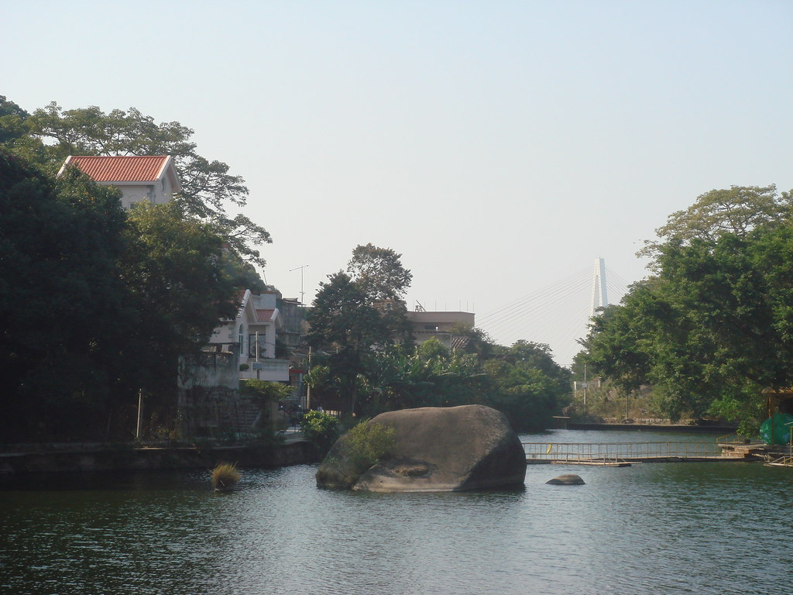
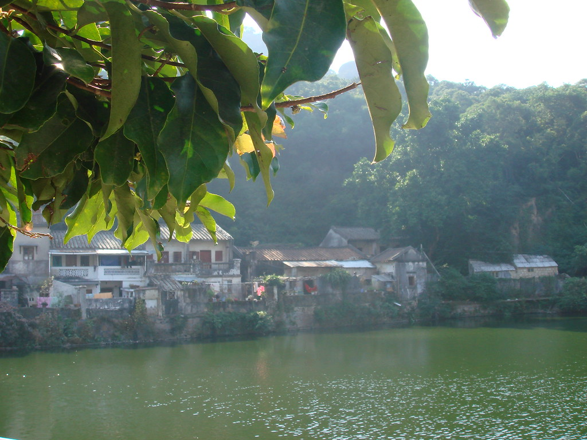
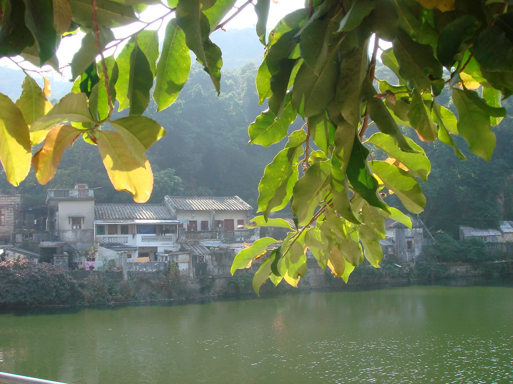
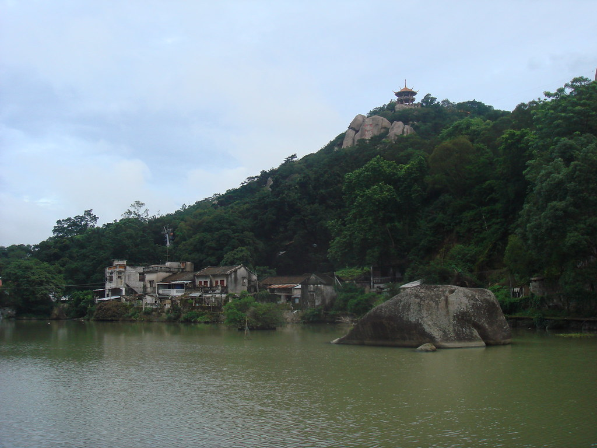
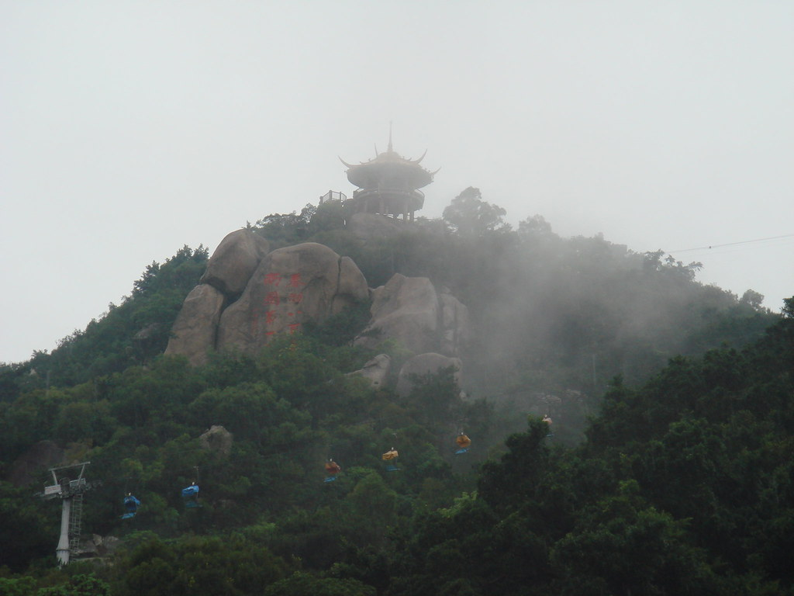

之前的摄影展：[一](https://sinyalee.com/blog/?p=190 "这就是金中——Sinya个人摄影展之一")、[二](https://sinyalee.com/blog/?p=208 "Eyes of Night——Sinya个人摄影展之二")、[三](https://sinyalee.com/blog/?p=215 "桥——Sinya个人摄影展之三")。

李勇老师在这个星期二的长达两个小时的班会课上跟我们讲到他以前一个学生有一天突然发现，石球湖的水变绿了（是在说她恋爱了之后去石球湖边享受两人世界）。其实，石球湖的水本来就是那么绿，我也很早很早就发现石球湖的美丽。

对了，如果不知道石球湖在哪里，看看[地标文件](http://sinyalee.com/others/shiqiuhu.kmz "石球湖的地标文件")。

这三张是第一学期在星期六下午的数学竞赛班结束后在回家的路上拍的

这两张是上个学期末在去学校的路上拍的。虽然第二张是飘然亭，但是因为是同个时候拍的，所以也就放上来了。

最后来一张在Google Earth上看到的，也是石球湖的景象。还有这些楼房已不复存在，被人买去起别墅了……

Update:

最后这一张不是我自己拍的，是在Google Earth上面看到的。惭愧了。

Dec 19th, 2008