這個周末，由于高三英語口語考試，金中高二暫時放假，而飛廈沒有。所以我們原來904班，在周六便跑去飛廈混了一個上午。這是我們畢業后第二次回校，第一次要到一年半以前了，見[昨天回飞厦中学](https://sinyalee.com/blog/?p=103)。比較可惜，只有金中的同學有過去，本來還想可以看看原來的同學們。

我們一群人，“掃蕩”完每個辦公室，找有沒有教過我們的老師。我們遇到了XYZ，英語肖老師，化學胡老師，歷史老師（開著一輛汽車進學校然后不帶我們進去）……

然后我們去找猥瑣的詹玉龍老師。我跑到9班，抓到一個小師妹，問她們班今天有沒有物理課，阿詹有沒有在。很讓人失望地，詹老師沒有在。當我正要離開的時候，突然意識到了什么，就回過頭去問那個女生：“阿詹有沒有捏過你的臉？”結果，不出我所料，那個女生露出了幽怨的神情，轉過頭去，嘆了一口氣，意味深長的說：“誰沒有被他捏過呢……”

\= =|||

在飛廈，看到好多可愛的弟弟妹妹們，看到他們在飛廈那么那么有活力，那么有春天的起立，玩的那么快樂，我真的很開心。

\==========================================================================

貼幾張相片。

[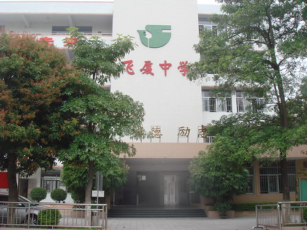](http://www.flickr.com/photos/sinya/3378252554/ "Flickr 上 Sinya Lee 的 飞厦中学") 

[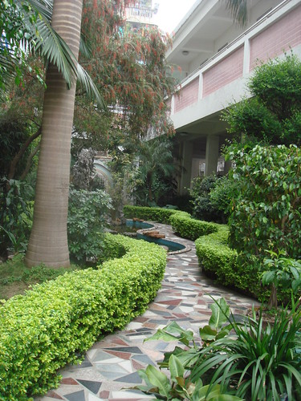](http://www.flickr.com/photos/sinya/3377445033/ "Flickr 上 Sinya Lee 的 飞厦中学生物园") [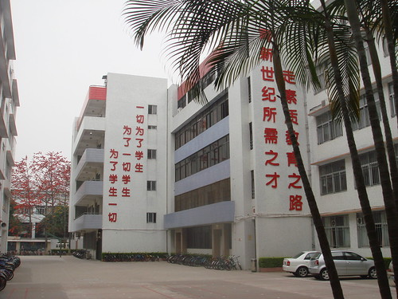](http://www.flickr.com/photos/sinya/3378270324/ "Flickr 上 Sinya Lee 的 飞厦中学")

[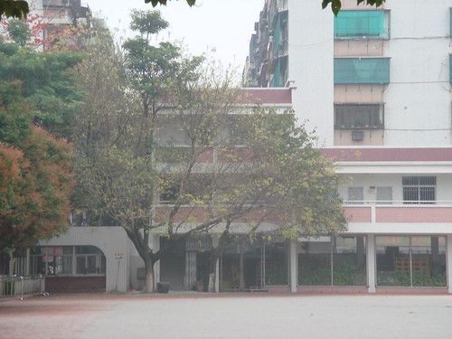](http://www.flickr.com/photos/sinya/3377393553/ "Flickr 上 Sinya Lee 的 飞厦中学") [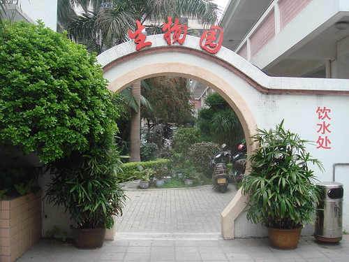](http://www.flickr.com/photos/sinya/3377440115/ "Flickr 上 Sinya Lee 的 飞厦中学生物园")

[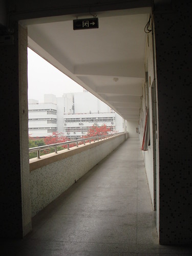](http://www.flickr.com/photos/sinya/3377383835/ "Flickr 上 Sinya Lee 的 飞厦中学") 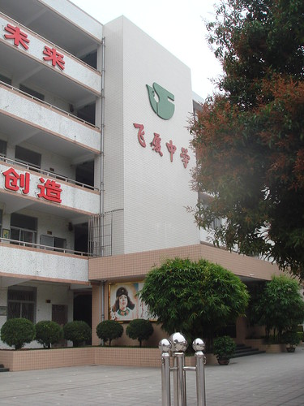

一切都那么熟悉，好像時間從來沒走，一切都那么親切，好像，從來沒有疏遠過一樣。

\================================================================================

三月，正是木棉花盛開的時節。

那火紅火紅的木棉花，又似乎，把我帶回了初中的年華。

[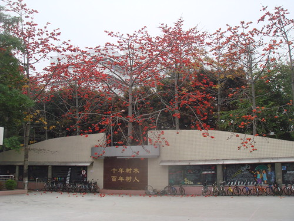](http://www.flickr.com/photos/sinya/3377425393/ "Flickr 上 Sinya Lee 的 飞厦中学的木棉树")

[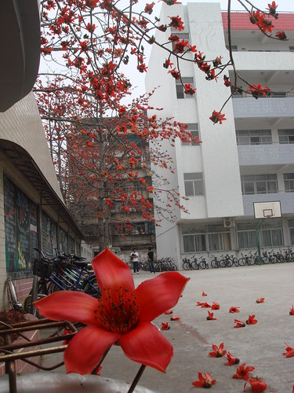](http://www.flickr.com/photos/sinya/3377409317/ "Flickr 上 Sinya Lee 的 飞厦中学的木棉花") [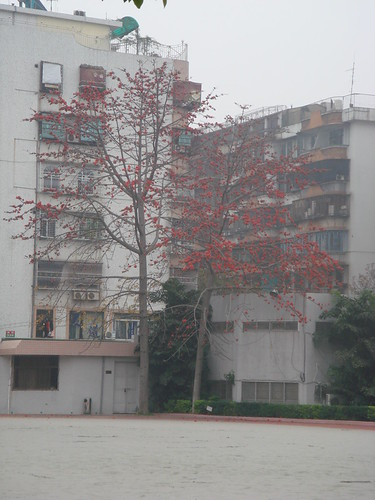](http://www.flickr.com/photos/sinya/3378215962/ "Flickr 上 Sinya Lee 的 飞厦中学的木棉树")

[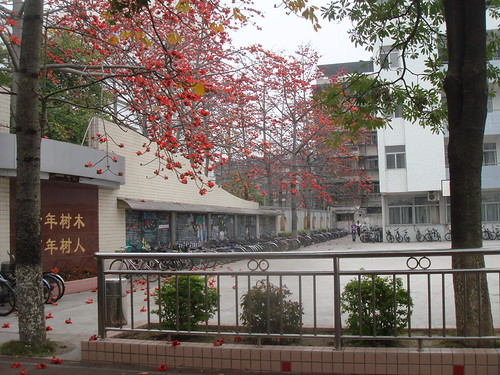](http://www.flickr.com/photos/sinya/3378221268/ "Flickr 上 Sinya Lee 的 飞厦中学的木棉树")

不知道為什么，每次看到這些木棉樹，幸福的感覺總是油然而生。

\=========================================================================

最后，離開的時候，很不舍的照了一張相片：

[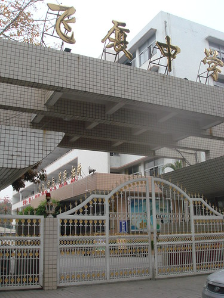](http://www.flickr.com/photos/sinya/3377459013/ "Flickr 上 Sinya Lee 的 飞厦中学大门")

上次拍下這個場景是什么時候？

2007的盛夏光年：

[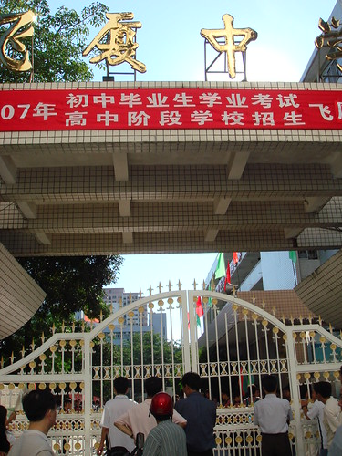](http://www.flickr.com/photos/sinya/3377463503/ "Flickr 上 Sinya Lee 的 中考")

同樣的Sony-T30，不同樣的環境，不同樣的心境，不同樣的我。

\===================================================================

周六下午，“屁顛屁顛”騎著一輛腳車跑到飛廈的信息學競賽班。

3年前，不知道，在這里，度過了多少個周六的下午。在那些破舊的電腦上，寫過了多少程序。

在那里，我跟那些師弟師妹們講了IOI 1994的The Clocks這道題。當我從深搜講到寬搜在講到套9層for語句的猥瑣方法時，我看到了那些弟弟妹妹們眼里閃爍著光芒。似乎，在他們的眼睛里，我看到了FXOI的希望。

\===================================================================

周日，我再次“屁顛屁顛”騎著一輛腳車跑到東廈。在那邊，我跟那些剛剛入門初一的弟弟妹妹講了深搜——這個比較有挑戰性，畢竟他們什么都不懂。

其實最主要我在那邊作APIO 2007的Zoo這道題……

東廈，除了沒有那些木棉樹，感覺跟飛廈有很多類似之處。其實我去過市區的一中三中四中，總是讓人覺得很溫馨，給人很熟悉的感覺。

那些市區中的小小的學校，讓人覺得特別親切，特別有安全感。總是覺得，在市區讀書，更有利于全面發展。不像某個[直叫人抓狂的學校](https://sinyalee.com/blog/?p=395)。

貼一張2周前跟gXX去東廈拍下的相片：

[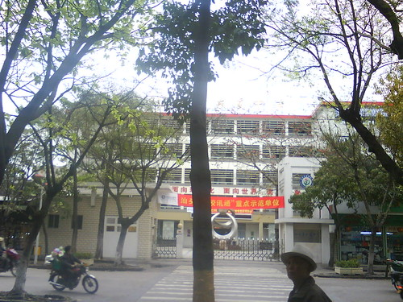](http://www.flickr.com/photos/sinya/3377738471/ "Flickr 上 Sinya Lee 的 東廈中學")