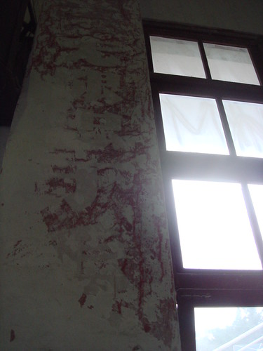
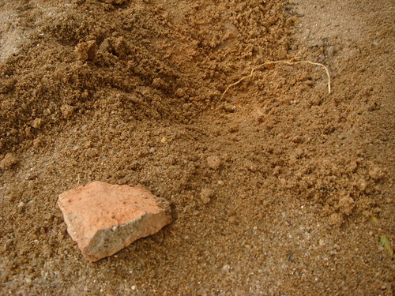

某一天，学校大礼堂装修，露出了如下的标语:

上面写着：“无限忠于毛泽东思想”。Sinya看了之后深受感染，觉得我们应该深入学习并无限忠于毛泽东思想。

而且，Sinya觉得，我们要上好政治课，践行毛泽东思想。应该离开单调无聊的教室，去体验一下生活。于是Sinya便去除杂草了。Sinya一点都不马虎，对杂草都是连根拔起的：

后来，亲爱的李勇老师找Sinya去谈话，摘录如下：

> 亲爱的李勇老师：男人，要有骨气，血气，还要“棱气棱声”
> 
> Sinya：阿？
> 
> 亲爱的李勇老师：可恶的Sinya，你太坏了，你想到哪里去了！
> 
> （于是Sinya便受到亲爱的李勇老师的狂捏）

后来，Sinya才发现，李勇老师的“棱气棱声”是：“能屈能伸”的意思。

这件事告诉我们，Sinya是个纯洁的乖孩子。李勇是个邪恶的老男人。