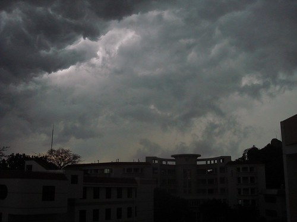
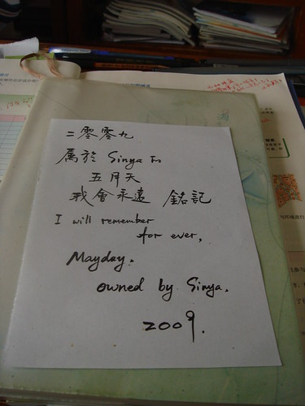
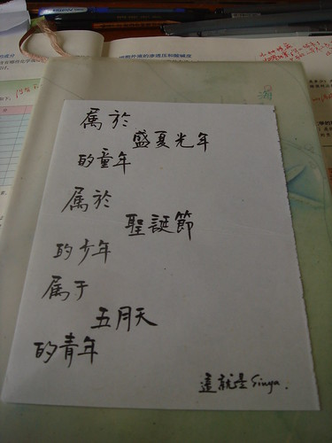

2009的春，2009的四月，注定不是屬于我的……

其實，什么時候，春，曾經屬于我呢？

只有這圖片可以代表，Sinya，的春：

\====================================

六天前，周日。當時，離五月天，還有半個月。

可是我還是在紙上寫下了這些文字：

2009

屬于 Sinya 的

        五月天

    我會永遠   銘記

I will remember

              for ever,

     Mayday,

          owned by Sinya,

                2009

\====================================

或許，真的是這樣子：

屬于

       盛夏光年

的童年

屬于

       圣誕節

的少年

屬于

       五月天

的青年

                                                     這就是Sinya