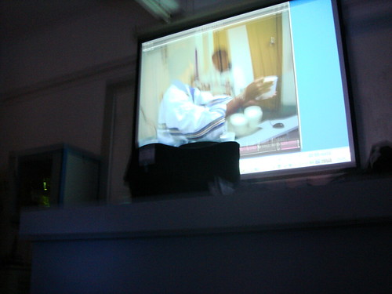
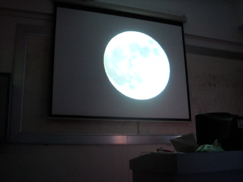
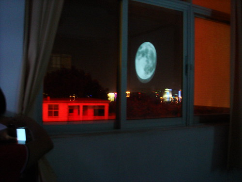
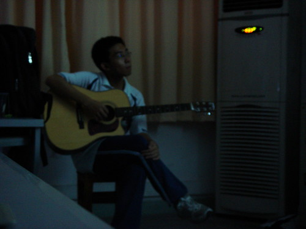
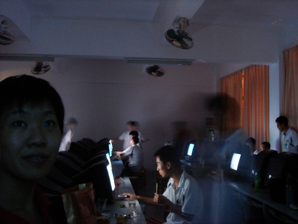

嗯，我的电脑告诉我今天是民国98年10月1日，或曰国殇60周年哀悼日。因为60跟50的gcd是10，恰好跟我们的手指头一样多，所以我们敬爱的领导们搞一个阅兵仪式。

阅兵一回事，还要在市中心阅，把整一条道路都给封了，把沿线好多楼房给封锁了，飞机不让飞，连和平鸽也不让在北京飞⋯⋯去检阅那些经常威胁我这种良民说要把我的相机扔掉的士兵是一回事，毕竟他们是听党指挥的嘛，然后他们还要搞什么说全国所有人民都拥护党和政府的领导，把北京大学的学生拉过去训练三个月不读书然后上去走一圈回来，清华的新生不幸也被抓过去⋯⋯抓大学生一回事，甚至把中小学生抓过去——大家好团结啊⋯⋯

\*\*\*\*\*\*\*\*\*\*\*\*\*\*\*\*\*\*\*\*\*\*\*\*\*\*\*\*\*\*\*\*\*\*\*\*\*\*\*\*\*\*\*\*\*\*\*\*\*\*\*\*\*\*\*\*\*\*\*\*\*\*\*\*\*\*\*\*\*\*\*\*\*\*\*

我们来讲中秋月饼会。**学校领导请直接关闭此页面****。**

金中竞赛班在伟大的姚老师的带领下历来就有自由散漫的传统。什么中秋月饼会还有什么冬节汤圆会都是历来的保留节目。冬节汤圆会每次都要搞到电脑上沾满了面粉汤水飞溅一地外加电源跳闸⋯⋯

中秋月饼会稍微正常一点。鉴于中国人丑恶的送礼传统，一些人特别是那些头衔带着一个“长”字的老男人老女人一到中秋就有很多月饼进账又吃不完所以到处找人帮忙吃掉。所以中秋就让学生把家里吃不完的月饼带过来，然后在机房开party。

今年节目好多⋯⋯比如合唱温柔，倔强。比如Sivon的吉他演奏。当然还有CS交流会，平时在机房我还可以虐虐竞赛班的同学（竞赛般大部分人没沉迷于玩游戏，水平都比较低），突然一个高一师弟过来，枪法好生厉害⋯⋯

嗯，贴视频先：

温柔

倔强

然后再贴图。

这是播放的很多年年前（师兄师姐）的冬节月饼会场景：

我们由于假期前就开月饼会，所以月来不圆，于是做了个人工的：

然后就发现窗外：

Sivon和他的吉他

机房⋯⋯

再来一张之前拍的真正的金中的月！

\*\*\*\*\*\*\*\*\*\*\*\*\*\*\*\*\*\*\*\*\*\*\*\*\*\*\*\*\*\*\*\*\*\*\*\*\*\*\*\*\*\*\*\*\*\*\*\*\*\*\*\*\*\*\*\*\*\*\*\*\*\*\*\*\*\*\*\*\*\*\*\*\*\*\*  
来一个友情链接，来自gxx的blog

[http://gxxspath.blogbus.com/logs/47399010.html](http://gxxspath.blogbus.com/logs/47399010.html)